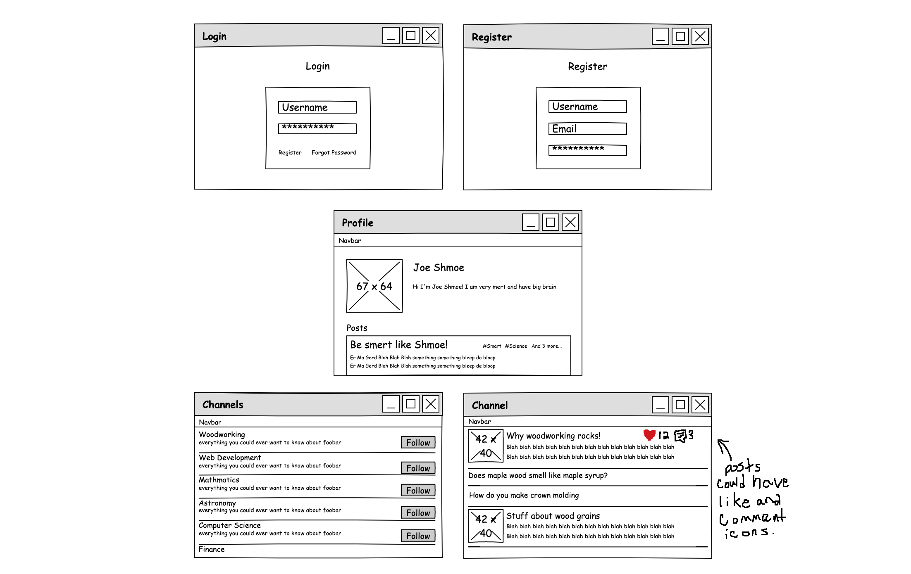
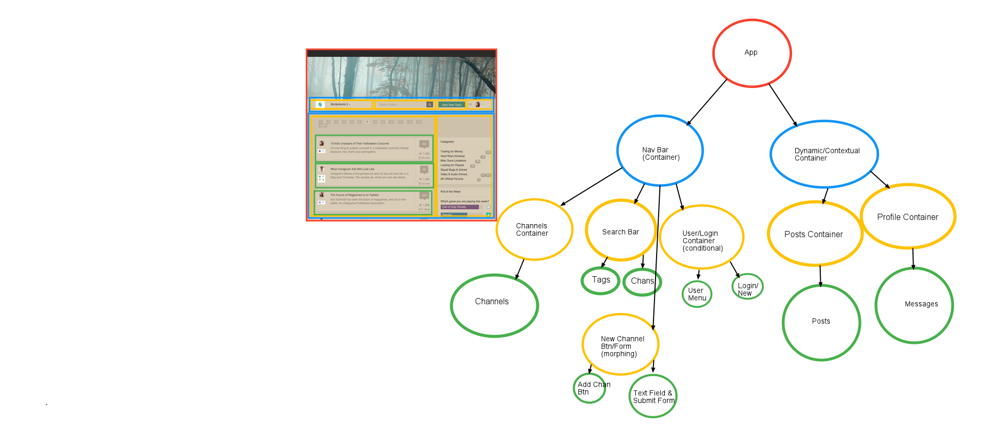
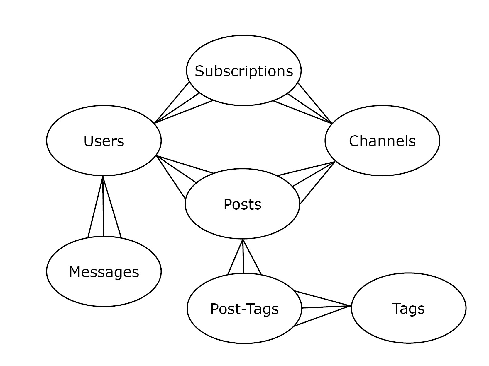

# mind-smith
A social media site designed to connect curious people together to discover new interests.

Mind Smith
- Team of three / one week project
- Idea: Reddit-like advice aggregation platform / Forum
- Custom CSS styling
- Decoupled architecture with React frontend and Ruby on Rails backend
- PostgreSQL with Active Record
- Database schema with Users, Categories, Posts
- Simple chat feature (CSS styled chat box) that uses periodic polling with JavaScript fetches (no sophisticated websockets)
- Like feature for posts
- User profile pages
- Challenges:
 - Functionality seems simple but requires many queries (latest posts / sort by likes or category etc.)
 - Deep nesting increases complexity due to multiple relationships (Users write Posts in Categories and Users like Posts and Users reply to Posts, etc.)
 - Many different pages that deal with different aspects (display by category, display newest posts, display users post, etc.)
 

